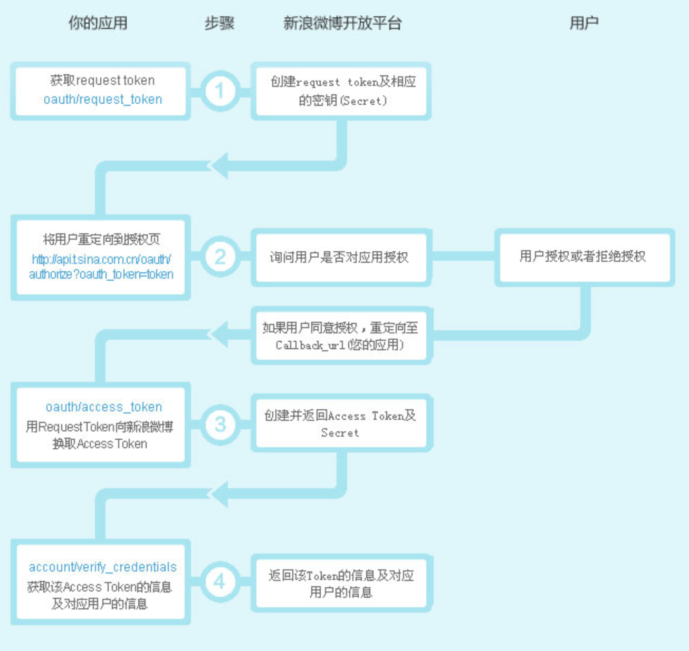

# 探索软件系统架构的4+1视图

## [原文地址](https://juejin.cn/post/7271283075171205156)

## 4+1视图概述

想要规划一套优秀的系统，最重要的步骤是要先将要设计的系统的“系统结构”规划完善，尤其是使用目前最新的组建和分布式系统结构分析时，系统结构分析的优良与否，已决定了该套系统百分之九十的失败。优良的系统软件结构在开发和网络时代就显得特别重要。一个优秀的系统蓝图的架构设计才能让日新月异的软件开发技术在开发系统时用来得心应手，而不是让我们永远追着技术跑。

1995年，`Philippe Kruchten`在`《IEEE Software》`上发表了题为《The 4+1 View Model of Architecture》的论文，引起了业界的极大关注。

> [www.cs.ubc.ca/\~gregor/tea…](https://link.juejin.cn/?target=https%3A%2F%2Fwww.cs.ubc.ca%2F~gregor%2Fteaching%2Fpapers%2F4%2B1view-architecture.pdf)

<figure><figcaption></figcaption></figure>

后来，Philippe Kruchten加入Rational，他的4+1视图方法演变为著名的、为许多架构师所熟知的“RUP 4+1视图方法”。这种结构已成为软件开发过程中不可缺少的概念，所谓“4+1”视图指的是“逻辑视图（`Logical View`）”、“实现视图（`Implementation View`）”、“进程视图（`Process VIew`）”、“部署视图（`Deplopment View`）”和 "场景视图"（`scenarios`）“用例视图（`Use-Case View`）”。

<figure><figcaption></figcaption></figure>

* 逻辑视图（`Logical View`）：以面向对象的概念来表达软件设计的结果。逻辑视图（`Logical View`）主要描述实现系统内部功能性工作的细部设计，这些设计包括静态结构和动态的行为。
* 实现视图(`Implementation View`)：以模块（`Module`）或组建（`Component`）来表现出按照逻辑设计的对象（`Object`）是在哪一个模块或组建中实现。
* 进程视图（`Process View`）：通常一个典型的分布式系统，一般都包含许多进程或者线程。进程视图（`Process VIew`）即是描述一个系统中各组成部分整体运行的程序。
* 部署视图 (`Deplopment View`)：部署视图是指在网络环境中，充分表示进程或者线程对应到主机或者设备的实际状态。也就是描述系统硬件或设备之间的链接关系，和软件程序的配置状况。
* 用例视图(`UseCase VIew`)：主要作用是说明系统功能性的需求，找出系统中国呢使用案例（`UseCase`）与角色（`Actor`），和利用使用案例的模型来充分表达出软件功能的需求。

下面我们来看下这几种架构（视图）的画法。

## 用例图

### 概述

场景视图是一种需求分析技术，通常采用UML的用例图进行设计。通过用例视图的设计过程，可以正确的识别系统的用户和其它系统（`Actor`）、系统边界（`Boundary`）和用例（`Use Case`），并对系统的功能场景进行充分的分析，以确定系统提供的功能可以满足用户需求。

* 用例图主要模拟系统中的动态行为，并且描述了用户、需求、以及系统功能单元之间的关系。
* 用例图由参与者 (用户) ，用例 (功能) 和它们之间的关系组成。

**目的**

1. 用来收集系统的要求。
2. 用于获取系统的外观图。
3. 识别外部和内部影响因素。
4. 显示要求之间的相互作用是参与者。

### 用例图画法

| **组成元素**           | **说明**                                                                             | **符号表示**                                                                 | **备注**                                                                                                                                                                                                                                                                                                          |
| ------------------ | ---------------------------------------------------------------------------------- | ------------------------------------------------------------------------ | --------------------------------------------------------------------------------------------------------------------------------------------------------------------------------------------------------------------------------------------------------------------------------------------------------------- |
| 参与者（actor）         | 参与者（actor）在建模过程中处于核心地位，actor是在系统之外与系统交互的人或事物。用一个小人表示。                              |  | 
1. 找出参与者：参与者一定是直接并主动地向系统发出动作并反馈，否则就不是参与者。 2. 谁对系统有着明确的目标和要求并主动发出动作？ 3. 系统为谁服务？业务工人（business worker）：被动参与业务处于系统边界内部。
                                                                                                                                                                                |
| 用例 (User Case)     | 用例定义了一组用例实例，每个实例都是系统所执行的一系列动作。用一个椭圆代表。                                             |  | 
用例特征：1. 用例是相对独立的 2. 用例的执行结果对参与者来说是可观测和有意义的 3. 这件事必须由一个参与者发起 4.用例必然由动宾短语形式出现的 5.一个用例就是一个需求单元、设计单元、开发单元、测试单元，甚至部署单元 用例的粒度：1. 概念建模阶段：每个用例描述一个完整的事件流。2. 系统建模阶段：每个用例能够描述操作者与计算机的一次完整交互用例粒度的划分依据最标准的方法以该用例是否完成了参与者的某个完整目的为依据。 用例的来源：1. 一个明确有效的目标 2. 一个真实的目标应当完备的表达主角的期望 3. 一个有效的目标应当在系统边界内，由主角发动并具有明确的后果
 |
| 关联关系 (Association) | 表示参与者与用例之间的关系。用一个直线箭头表示                                                            |  |                                                                                                                                                                                                                                                                                                                 |
| 包含关系 (Include)     | 表示一个大的功能分解成多个小模块的动作。用一个带包含文字的虚线箭头表示                                                |  |                                                                                                                                                                                                                                                                                                                 |
| 扩展关系 (Extend)      | 表示用例功能的延伸，相当于是为用例提供附加功能。用一个带扩展文字的虚线箭头表示                                            |  |                                                                                                                                                                                                                                                                                                                 |
| 边界                 | 用来表示正在建模系统的边界。边界内表示系统的组成部分，边界外表示系统外部。系统边界在画图中用方框来表示，同时附上系统的名称，参与者画在边界的外面，用例画在边界里面。 |  | 边界是可大可小的，由建模者主观确定。边界的确定是一个动态的过程，没有明确的方法。需求过程是一个动态的过程，不可能一蹴而就，我们只能把这些不同的结果进行对比、思考、讨论，最终希望得到一个更恰当的结果，就像盲人摸象—样，多方结果的相互印证得出的结论总是会更接近真相。所以在建模过程中，如果对建模结果感到疑惑，就可以试着改变边界设定，得到不同的参与者和用例，再通过相互印证的方式得到更好的结果。系统边界的作用有时候不是很明显，在画图时可省略。                                                                                      |

**依赖、泛化会增加用例复杂度，一般不会使用。这里不再展开说明**。

## 逻辑视图

### 概念

用于描述系统的功能需求，即系统给用户提供哪些服务；以及描述系统软件功能拆解后的组件关系、组件约束和边界，反映系统整体组成与系统如何构建的过程。

### 画法

软件设计最重要的原则就是高内聚、低耦合，一个满足此原则的系统不应该存在不合理的依赖关系，比如下层与上层间的反向依赖，或是循环依赖等。

一般，逻辑架构元素决定了开发组织（根据康威定律，反之亦然）。因此，逻辑元素的边界和接口也是后续多个开发组织之间进行接口控制的关系依据。设计合理的逻辑架构，可以提升团队的沟通效率，进而提升整个系统的交付效率和质量。

下面springcloud微服务的逻辑视图示例（仅部分），就描述了springcloud中各个功能组件。从这个图中，基本可以对springcloud有一个大颗粒度的了解。

<figure><figcaption></figcaption></figure>

## 开发视图

#### 概述

开发视图用于描述系统的模块划分和组成，以及细化到内部包的组成设计，服务于开发人员，反映系统开发实施过程。

开发视图一般使用包图、组件图。

### 包图

**包图说明**

包是一种容器，如同文件夹一样，它将某些信息分类，形成逻辑单元。使用包的目的是为了整合复杂的信息，某些语义上相关或者某方面具有共同点的信息都可以分包。

**包图画法**

| **组成元素**   | **说明**                                                                                                                | **符号表示**                                                                  |
| ---------- | --------------------------------------------------------------------------------------------------------------------- | ------------------------------------------------------------------------- |
| 包（package） | 当对一个比较复杂的软件系统进行建模时，会有大量的类、接口、组件、节点和图需要处理；如果放在同一个地方的话，信息量非常的大，显得很乱，不方便查询，所以就对这些信息进行分组，将语义或者功能相同的放在同一个包中，这样就便于理解和处理整个模型 |  |
| 关系         | 包之间的关系定义只有依赖关系。UML认为好的分包具有高内聚、低耦合的性质。用一个带箭头的虚线，指向被使用者                                                                 |  |

分包有这样一些指导性原则∶

* 如果将元素分为三个包A、B、C，那么被分入同一个包中的那些元素应当是相互联系紧密，甚至不可分割的。同时这些元素又具有某些相同的性质，使得包可以抽象出一些接口来代表包内事物与包外的事物交互，以避免包外的事物频繁地直接访问包内元素。这时我们称 A、B、C三个包具有高内聚的性质。
* 包的最理想的情况是修改A、B、C三个包中任意一个包的元素，其他的任何一个包中的内容都不受到影响。这时我们称A、B、C三个包之间无依赖关系或松耦合关系，它们之间可以保持消息通信。
* 如果实际情况难以做到完全解除依赖关系，那么至少应当保证包之间的依赖关系不会被传递。例如 B依赖于A，C依赖于B，当A 修改导致B要做出修改时，C不会受到影响。如果做不到这一点，当一个包发生变动时将会引起大范围的连锁反应。
* 包之间的依赖关系应当是单向的，应当尽量避免双向依赖和循环依赖。如果A依赖于B，而B又依赖于A，我们称这是一种双向依赖关系;如果A依赖于B，B依赖于C，而 C 又依赖于 A，我们称这是一种循环依赖关系。双向依赖和循环依赖都是不好的分包。

### 组件图

**组件图说明**

组件图是一种可用来设计系统的静态实现视图的图形，通过组件图可以表现出一组组件的组织和其之间的关系。组件图也是UML的建模图形中可用来设计面向对象系统实体角度的图形之一。基本上，组件图是一种针对系统组件所绘制的类图。

**组件图画法**

| **组成元素**      | **说明**                                                                                                                                                    | **符号表示**                                                                  | **备注**                                               |
| ------------- | --------------------------------------------------------------------------------------------------------------------------------------------------------- | ------------------------------------------------------------------------- | ---------------------------------------------------- |
| 组件            | 是系统设计的一个模块化部分，它隐藏了内部的实现，对外提供了一组接口。组件是一个封装完好的物理实现单元，它具有自己的身份标示和定义明确的接口。并且由于它对接口的实现过程与外部元素独立，所以组件具有可替换性。                                                    |  | 组件的特征：• 组件是基于接口定义的• 组件的内部实现是自包含的• 组件的使用是可替换的         |
| 界面（Interface） | 
接口是一组用于描述类或组件的服务的操作，它是一个被命名的操作的集合。对于一个组件而言，它有两类接口，提供接口与需求接口。 • 提供接口：又被称为导出接口或供给接口，是组件为其他组件提供服务的操作的集合。 • 需求接口：又被称为引入接口，是组件向其他组件请求相应服务时要遵循的接口。
 |  | 接口与类不同，它不描述任何结构（因此不包含任何属性），也不描述任何实现（因此不包含任何实现操作的方法）。 |
| 关系            | 
• 依赖关系: 1. 组件与需求接口之间建立依赖关系 2.组件与组件之间建立依赖关系：说明在运行过程中A在某些行为上依靠组件B的支持 • 实现关系: 组件与提供接口之间建立实现关系 • 关联:组件之间的关联关系，用直线表示
                              |  |                                                      |

## 处理视图

#### 概述

处理视图，又称过程视图、运行视图。用于描述系统软件组件之间的通信时序，数据的输入输出。在UML中通常由时序图和流程图表示，如下图所示： 

#### 时序图画法

时序图(`Sequence Diagram`)，又名序列图、循序图，是一种UML交互图。它通过描述对象之间发送消息的时间顺序显示多个对象之间的动态协作。

| 元素                 | 描述                                          |
| ------------------ | ------------------------------------------- |
| 进行角色（`Actor`）      | 在交互中扮演特定角色的实体，可以是人、系统、外部组件等。                |
| 对象(`Object`)       | 在交互中参与通信的实体，表示在系统中存在的具体对象，可以是类的实例、组件等。      |
| 生命线(`LifeLine`)    | 表示对象在整个交互中的存在时间，是对象的生命周期，通常与对象的生存期一致。       |
| 控制焦点(`Activation`) | 表示对象活跃时的时间段，用于标识对象的操作或消息发送的时间段，用虚线框表示。      |
| 消息(`Message`)      | 表示对象之间的通信或交互，可以是同步消息、异步消息、返回消息等。            |
| 自关联消息              | 表示对象发送消息给自身的情况，用于描述对象的自我调用或自身处理。            |
| 组合片段               | 用于表示在一段时间内特定的控制流程或行为，可以嵌套在时序图中，用来划分不同的交互片段。 |

时序图元素通过各种连接和注释，共同描述了对象之间的交互过程，以及它们的执行顺序和时序关系。这有助于开发人员更好地理解系统中的消息传递和协作情况。

找了个例子，大家可以看下：&#x20;

<figure><figcaption></figcaption></figure>

## 物理视图

#### 概述

物理视图是软件架构中的一部分，用于描述系统的物理部署和运行环境。它关注于如何将软件系统部署在硬件设备上，并展示了不同组件、模块、服务在物理设备上的布局和交互关系。物理视图帮助开发人员和架构师理解系统的部署情况，以及硬件资源的利用情况。在UML中通常由部署图表示。

#### 画法

下面是 UML 部署图中常见的元素以及它们的属性：

| 元素类型                          | 描述                        | 示例                            |
| ----------------------------- | ------------------------- | ----------------------------- |
| 节点（Node）                      | 物理或虚拟的计算资源，代表部署目标的硬件或软件环境 | Web 服务器、数据库服务器，既可以是物理机器也可以是容器 |
| 构件（Component）                 | 系统中可部署和替换的模块单元            | 数据库组件、应用服务器组件                 |
| 节点关系（Node Relationship）       | 表示节点之间的连接或依赖关系            | 连接、依赖                         |
| 部署关系（Deployment Relationship） | 节点与构件之间的部署关系              | 部署、关联                         |
| 网络（Network）                   | 物理或逻辑的网络基础设施              | 局域网、互联网                       |
| 存储（Artifact）                  | 被部署的物件（如文件、数据库表）          | 配置文件、数据文件                     |
| 线条（Connector）                 | 构件之间的通信路径                 | 连接器、通信路径                      |

下面是一个实例：

<figure><figcaption></figcaption></figure>

## FAQ

### 用例与功能区别

* 功能是脱离使用者的愿望而存在的。我们常说某某工具有某个功能，它是描述工具的，而不是站在使用者的角度描述使用者的愿望的。功能用来描述某某东西能做什么，它与使用者的愿望无关，描述的是事物固有的性质。习惯于以功能来看待系统的团队，喜欢从系统的角度出发，说明系统能做什么，而常常系统能做什么并不是使用者关心的。用例是描述使用者愿望的。描述的是使用者对系统的使用要求，用用例来看待系统的团队，则是从使用者角度出发，说明使用者将在系统里做什么。
* 功能是孤立的，给一个输入，通过计算就有一个固定的输出——只要按下开关灯就亮。用例是系统性的，它需要描述谁在什么情况下通过什么方式开灯结果是什么。功能描述的是一个个点，如果要达成一个特定的目标;必须要再额外加上一个顺序的过程把点事起来才能完成一个系统性的工作。而用例描述的是一个系统性的工作，这个系统性的工作非常明确地去达成一个特定的目标。习惯使用功能分解来看待系统的团队，习惯从开发者角度出发，费供大量的功能点，指望客户像UNIX高手一样，自己从指令集中找到适合的指令来完成工作。而用用例来看待系统的团队，习惯从客户角度出发，为客户量身定制他们的要求。
* 如果非要从功能的角度解释用例，那么用例可以解释为一系列完成一个特定目标的"功能"的组合，针对不同的应用场景，这些"功能"体现不同的组合方式。并且，不是先有了这些"功能"才来组合成某个场景，而是先有了场景，才分解出"功能"。这里的"功能"之所以打引号，是因为在UML 里是没有功能这个词的，实际上从场景分解出来的是对象，这些对象通过消息相互交流而完成场景。

### 组件图与类图区别

* 抽象层次：类图侧重对单个实体和细节逻辑的抽象；组件图侧重对模块化和部署实现的抽象
* 抽象粒度：类图中以类、接口及它们之间关系为粒度；组件图中以功能单元为粒度，通常是若干个类或接口组成
* 外部调用：外部调用类图中的类时可以根据其可见性直接调用其属性和操作；外部调用组件图中的组件则只能通过接口访问其操作
* 可部署性：类图与单个实体和逻辑相对应，组织结构较为分散，不具有可部署性；组件图中的组件本身就是模块化、接近最终实现的功能单元，具有可部署性

### 组件图与包图区别

* 抽象层次：包图侧重对类、接口及包等元素的容器性抽象；组件图侧重对库文件、源代码文件、可执行文件等的模块化抽象
* 组织结构：包图侧重静态的、不再改变的文件结构；组件图侧重动态的、随编译/链接/执行过程改变的文件结构
* 可部署性：包图侧重源文件间的组织关系和层次，不具有可部署性；组件图中的组件本身具有动态可执行性，所以可部署
* 元素关系：包图元素之间的关系大多是静态包含或关联；组件图元素之间的关系大多是动态调用或实现

## 画图工具

#### Draw.io

[Draw.io](https://link.juejin.cn/?target=http%3A%2F%2FDraw.io) 是一个很好用的免费流程图绘制工具。

你可以利用它绘制一系列的图表、图示或图形，包括流程图、UML 类图、组织结构图、泳道图、E-R 图、文氏图等等，适用于商务、工程、电气、网络设计、软件设计等诸多领域的专业绘图。它致力于成为完全开源、免费、并且高质量的绘图软件。

#### plantuml

[plantUml](https://link.juejin.cn/?target=https%3A%2F%2Fplantuml.com): 是一个开源工具，能让你通过纯文本的方式来生成 UML 图（Unified Model Language 统一建模语言）。这与大家较为熟悉的 Markdown 非常类似。

idea也有插件:[idea插件](https://link.juejin.cn/?target=https%3A%2F%2Fplugins.jetbrains.com%2Fplugin%2F7017-plantuml-integration)，使用非常便捷，团队也容易维护。

通过 PlantUML，你可以通过同一套 Scheme 但是不同的语法来描述和生成不同类型的图。除了 UML 图外，PlantUML 也支持思维导图、甘特图等。我在这里会通过 PlantUML 来绘制类图、流程图和思维导图。具体在官方文档有详细描述。

这个是我比较喜欢的一个工具。一般时序图、用例图都会用它来画。

#### ProcessOn

[**processon**](https://link.juejin.cn/?target=https%3A%2F%2Fwww.processon.com%2Fi%2F58e76949e4b0e715d07ff451%3Ffull_name%3Dscoop%25EF%25BC%259F%2540%25EE%2590%2595) 是一个面向垂直专业领域的作图工具和社交网络，提供基于云服务的免费流程梳理，可以在线画流程图、思维导图、UI原型图、UML、网络拓扑图、组织结构图等等， 您无需担心下载和更新的问题，不管Mac还是Windows，一个浏览器就可以随时随地的发挥创意，规划工作。不过这个免费版使用次数有限。

#### startuml

[staruml](https://link.juejin.cn/?target=https%3A%2F%2Fstaruml.io%2F)**是一款很全面，很好用的UML画图工具**。 相比PlantUML那种使用代码画图方式，StarUML的拖拽式更简单易用。 StarUML支持类图、时序图、用例图等十几种图形模式。

\
作者：半亩方塘立身\
链接：https://juejin.cn/post/7271283075171205156\
来源：稀土掘金\
著作权归作者所有。商业转载请联系作者获得授权，非商业转载请注明出处。
